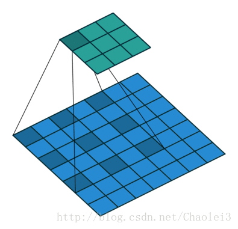
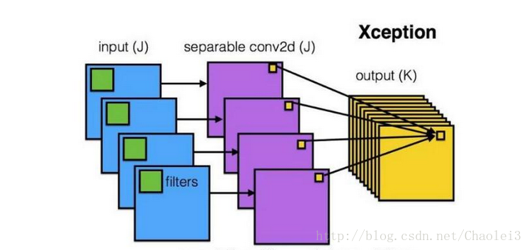
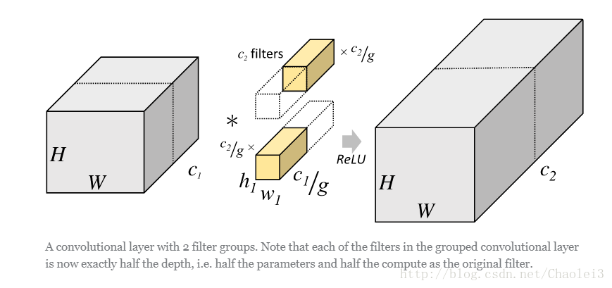
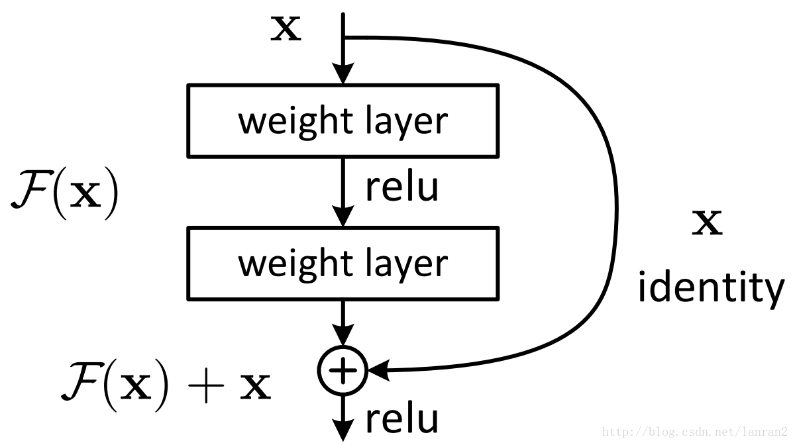
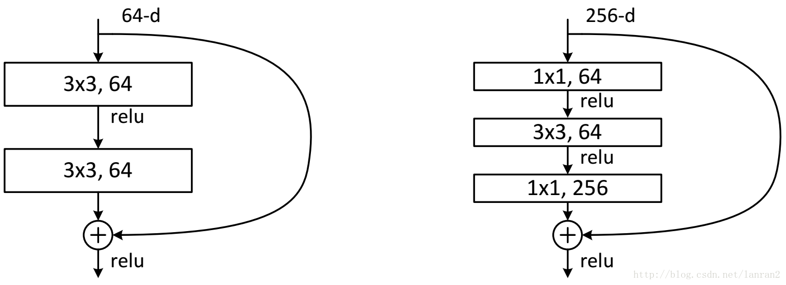
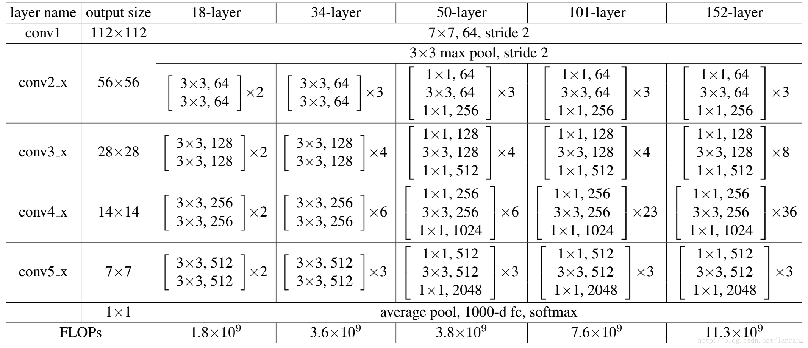
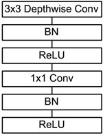

[TOC]

## MarkDown
#### 跳转测试
Hello World  
[XXXX](#jump)

## 几种常见的卷积方法
### 1. 数学中的卷积
为满足结合律，先**翻转**后“卷积”

### 2. 机器学习中的“卷积”
相比于数学中定义的卷积操作，机器学习中的卷积省略了**翻转**这一过程

### 3. local卷积(local conv)
> 参考至FaceBook的DeepFace网络([博客](https://blog.csdn.net/stdcoutzyx/article/details/46776415))

**思想**：
- 相比于机器学习中的卷积操作，Local-Conv的卷积核参数不共享。

**好处**：  
- 对齐的人脸图片中，不同的区域会有不同的统计特征，卷积的局部稳定性假设并不存在，所以使用相同的卷积核会导致信息的丢失
- 不共享的卷积核并不增加抽取特征时的计算量，而会增加训练时的计算量
- 使用不共享的卷积核，需要训练的参数量大大增加，因而需要很大的数据量，然而这个条件本文刚好满足。    

**应用**：
- [DeepFace](###DeepFace)

### 4. 空洞卷积
> 参考至：  
> [对几种常见卷积的简单理解](https://blog.csdn.net/blateyang/article/details/84640259)  
> [CNN 中千奇百怪的卷积方式大汇总](https://www.leiphone.com/news/201709/AzBc9Sg44fs57hyY.html)  
> [CNN中几个新的卷积方式](https://zhuanlan.zhihu.com/p/54033473)

**思想**：
- 将卷积核进行“扩张”（拉大间距产生空洞，产生的空洞weight以0值填充，有一个扩张率参数d，可理解成有效卷积点间的距离）  

**好处**：
- 在不增加卷积核参数量的前提下或者不进行下采样的条件下有效扩大感受野，在图像需要全局信息的问题中，能够很好的应用dilated conv

 
### 5. 深度可分离卷积(Depthwise separable convolution)

**思想**：
- 先逐通道地(depthwise)对输入数据体空间域做卷积，再沿着通道方向做1*1卷积进行通道融合    

**好处**：
- 将通道和空间区域进行解耦分离；
- 有效降低参数量(e.g 卷积权重参数$k*k*Ci*Co->k*k*Ci+1*1*Ci*Co$)   

**应用**：
- [InceptionNet](###InceptionNet)
- [MobileNet](###MobileNet)
- [MobileNet](###MobileNet)
- [MobileNet](###MobileNet)

### 6. 分组卷积
    
**思想**：
- 将输入数据体沿通道维度分成多组，对每组分别进行卷积，然后再将各组卷积的输出连接(concatenate)起来

**好处**：
- 同样可有效降低参数量(e.g 卷积权重参数$k*k*Ci*Co->k*k*Ci*Co/g$ 分成g组)
- [可在通道维度学习block-diagonal结构的稀疏性，使得网络中高相关的滤波器能够以一种更加结构化的方式被学习到，不容易过拟合，起到类似正则化的效果](https://blog.yani.io/filter-group-tutorial/)

**应用**：
- 待补充

## CNN Models
### ResNet
> 参考至[ResNet解析](https://blog.csdn.net/lanran2/article/details/79057994)    
> 参考至[ResNet结构分析](https://zhuanlan.zhihu.com/p/48169294)

#### ResNet结构

fig1. Shortcut Connection

两种残差块(residual block):     

(a) basicBlock 　　　　　(b) bottleNeck   

fig2. 两种residual block设计

    

对于常规ResNet(fig2. (a))，可以用于34层或者更少的网络中，对于Bottleneck Design(fig2. (b))的ResNet通常用于更深的如50/101/152这样的网络中，目的是**减少计算次数和参数量**。具体来说，右边的bottleNeck先用一个1x1的卷积把256维channel降到64维，然后在最后通过1x1卷积恢复，整体计算量为：
$$1\times1\times256\times64+3\times3\times64\times64+1\times1\times64\times256=69632$$
参数数目为：
$$1\times1\times64+3\times3\times64+1\times1\times256=896$$
对于左边basicBlock，若输入channel同样为256时，整体计算量为：
$$3\times3\times256\times256+3\times3\times256\times256=1179648$$
参数数目为：
$$3\times3\times256+3\times3\times256=4608$$
由于$F(x)$与$x$是按照channel维度相加的，网络中存在$F(x)$与$x$的channel个数不同的情况，因此需根据channel个数分为两种情况：
channel相同：   
$$y=F(x)+x$$
channel不同：   
$$y=F(x)+Wx$$
其中引入$1\times1$的卷积核$W$对$x$进行卷积操作，来调整$x$的channel维度。

不同层数下的ResNet结构如下图所示：

### MobileNet
> 参考至小小将[知乎](https://github.com/xiaohu2015/DeepLearning_tutorials), [GitHub](https://www.zhihu.com/people/xiaohuzc/posts?page=2)

MobileNet的基本单元是[深度可分离卷积（depthwise separable convolution）](#depthwise)，其实这种结构之前已经被使用在Inception模型中。  
  
fig1. Depthwise separable convolution  
如fig.1所示，深度可分离卷积可以分解为两个更小的操作：
- depthwise convolution
- pointwise convolution

Depthwise convolution和标准卷积不同，对于标准卷积其卷积核是用在所有的输入通道上（input channels），而depthwise convolution针对每个输入通道采用不同的卷积核，就是说一个卷积核对应一个输入通道，所以说depthwise convolution是depth级别的操作。而pointwise convolution其实就是普通的卷积，只不过其采用1x1的卷积核。
- 首先采用depthwise convolution对不同输入通道分别进行卷积
- 然后采用pointwise convolution将上面的输出再进行结合

这样其实整体效果和一个标准卷积是差不多的，但是会大大减少计算量和模型参数量。  
直观上来看，这种分解在效果上确实是等价的。比如，把上图的代号化为实际的数字，输入图片维度是11 × 11 × 3，标准卷积为3 × 3 × 3 ×16（假设stride为2，padding为1），那么可以得到输出为6 × 6 × 16的输出结果。现在输入图片不变，先通过一个维度是3 × 3 × 1 × 3的深度卷积（输入是3通道，这里有3个卷积核，对应着进行计算，理解成for循环），得到6 × 6 × 3的中间输出，然后再通过一个维度是1 × 1 × 3 ×16的1 ×1卷积，同样得到输出为6 × 6 × 16。

#### MobileNet网络结构
前面讲述了depthwise separable convolution，这是MobileNet的基本组件，但是在真正应用中会加入batchnorm，并使用ReLU激活函数，所以depthwise separable convolution的基本结构如fig.2所示。  

### DeepFace
> 参考至FaceBook的DeepFace网络([博客](https://blog.csdn.net/stdcoutzyx/article/details/46776415))   

DeepFace输入为152*152的图像，网络结构如下：
- Conv：32个11×11×3的卷积核
- max-pooling: 3×3， stride=2
- Conv: 16个9×9的卷积核
- Local-Conv: 16个9×9的卷积核，Local的意思是卷积核的参数不共享
- Local-Conv: 16个7×7的卷积核，参数不共享
- Local-Conv: 16个5×5的卷积核，参数不共享
- Fully-connected: 4096维
- Softmax: 4030维

前三层的目的在于提取低层次的特征，比如简单的边和纹理。其中Max-pooling层使得卷积的输出对微小的偏移情况更加鲁棒。但没有用太多的Max-pooling层，因为太多的Max-pooling层会使得网络损失图像信息。
后面三层都是使用参数不共享的卷积核，之所以使用参数不共享，有如下原因：
- 对齐的人脸图片中，不同的区域会有不同的统计特征，卷积的局部稳定性假设并不存在，所以使用相同的卷积核会导致信息的丢失
- 不共享的卷积核并不增加抽取特征时的计算量，而会增加训练时的计算量
- 使用不共享的卷积核，需要训练的参数量大大增加，因而需要很大的数据量，然而这个条件本文刚好满足。

全连接层将上一层的每个单元和本层的所有单元相连，用来捕捉人脸图像不同位置的特征之间的相关性。其中，第7层（4096-d）被用来表示人脸。
全连接层的输出可以用于Softmax的输入，Softmax层用于分类。

